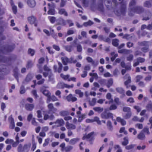
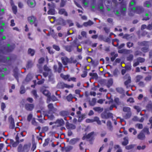
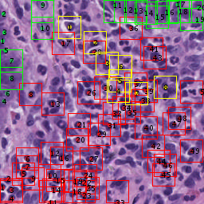

# Cut cell slice image in patches, using MATLAB


---

## Overview

### Data

There is a folder named '**annotated**' in '**./Cut Patches/HE/**',  contains
cell slice images that their  interest region were masked by red/green/yellow points.
You can also find the origin cell slice images in the  folder **'/Cut Patches/HE/raw'**.


### An example of data
origin image:



masked image:




### get\_cut\_patch\_demo.m

This program is used to show the result of the example image cut in patches(by masked boxes and numbers).

example:



### get\_cut\_patch.m

This program is used to save the result of all the  image in foldders cut in patches(and save the reslut index image in folder 'index').

all the outpputed images are saved at **'./Cut_Patches/result/HE/'**


### file\_scan.m

This program is used to find the images which are found at '/raw' but not found at 'annotated', means this images are not be masked and should not be cut in patches by program get\_cut\_patch.m .

### test\_read.m

This program is used to show the method of segmentation and  the segment result.

---

## How to use


This tutorial depends on the following libraries:

* MATLAB

This code should be compatible with MATLAB versions 2017b.

### Running

```
get_cut_patch('HE','annotated','raw');
```



##Contact me：

<bohrium.kwong@gmail.com>
